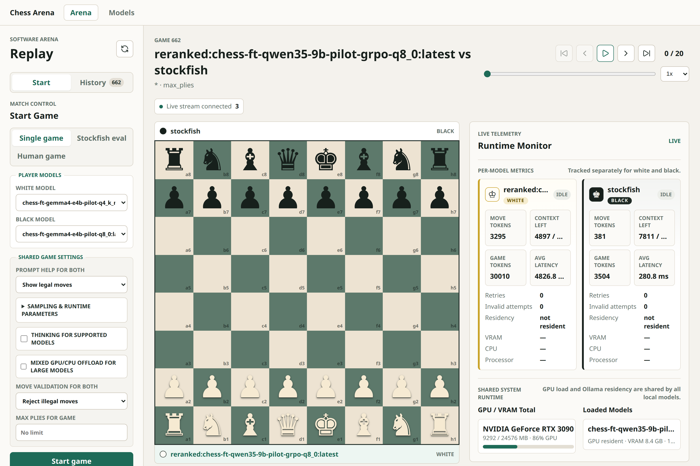

# ♟️ Physical AI Chessboard — LLM Chess Benchmark Arena

> A reproducible benchmark and experiment runner for making Large Language Models play chess —
> and measuring, at attempt-level granularity, *exactly* how and why they succeed or fail.

<p align="center">
  
</p>

<p align="center">
  
  
  
  
  
  
  
</p>

---

## What this is

This is **Phase 1 of the Physical AI Chessboard project**: a *software-only* arena that pits language
models against each other and against Stockfish, and turns every game into structured, queryable data.

The interesting product is **not** that LLMs can play chess. It is that **every move attempt — including
illegal and malformed ones — is persisted at attempt granularity, because that failure data *is* the
benchmark.** The system is designed as a rigorous experiment runner, not a toy.

Three design rules hold the whole thing together:

- **`python-chess` is the single source of truth.** The model never owns or mutates game state — it only
  *proposes* a move string. The board, legality, and result detection all live in the engine. The prompt
  is rebuilt from scratch every turn (the model's own prior moves are passed in explicitly), so "memory"
  is deterministic and reproducible rather than an accumulating chat log.
- **Never silently substitute a move in a scored run.** When a model exhausts its retries, the game is
  recorded as a `forfeit_invalid` termination. Failures are evidence, not something to paper over.
- **Everything is versioned and fingerprinted** — prompt version, template hash, quantization, sampler
  params, context window, Stockfish version/options — so any two numbers in the leaderboard are actually
  comparable.

A later **embodied phase** will reuse this engine by swapping the move source for a physical board
(camera + robot arm). That seam — the `MoveSource` protocol — is already in the code today.

---

## Why it's worth a look (for reviewers)

This repo demonstrates, end to end:

| Area | What's shown |
| --- | --- |
| **Backend architecture** | A pure-Python core (`arena_core`) with **zero web-framework imports**, wrapped by a thin FastAPI shell. The dependency arrow only points one way. |
| **Async data layer** | SQLAlchemy 2.0 async + Alembic migrations, SQLite now / Postgres-ready by design, attempt-level schema. |
| **LLM engineering** | Versioned prompt templates, a UCI-only move contract, retry/feedback loops, multi-provider adapters (Ollama, Anthropic, Gemini, OpenAI), and Ollama runtime control (quantization, context, GPU/CPU offload, thinking capture). |
| **Evaluation methodology** | Stockfish-as-judge with pinned binary + fixed nodes, centipawn-loss scoring, Wilson confidence intervals on every rate, and legality modes treated as *separate* benchmarks. |
| **Applied ML research** | A full **fine-tuning campaign on Qwen3.5 9B** — SFT (imitation + Stockfish distillation), GRPO reinforcement learning with a Stockfish reward, and a test-time reranker — each step gated by an offline proxy before spending GPU/arena hours. ([jump ↓](#-the-qwen35-9b-fine-tuning-story)) |
| **Full-stack product** | A React 19 + Vite UI with game replay, a multi-metric leaderboard, live match progress over SSE, and an interactive human-vs-model board. |
| **Engineering hygiene** | `ruff` + `mypy --strict` + `pytest` in CI, an architecture/data-model/eval doc set, and a written decision log behind every experiment. |

---

## Features

- **Model-vs-model and model-vs-Stockfish tournaments** — both colors per pairing, versioned opening
  suites, deterministic config hashes, full results materialized into leaderboard aggregates.
- **Two legality modes, always reported separately.** `open` (no legal-move list — the illegal-move rate
  is a first-class metric) vs `constrained` (legal moves provided). Combining them would be meaningless,
  so the UI never does.
- **Stockfish skill-capped opponents** (`beginner` ≈ 1320 ELO, `club` ≈ 1600 ELO) and Stockfish as a
  neutral judge for centipawn loss, blunder/mistake/inaccuracy classification, and mate handling.
- **A test-time reranker move source** (`reranked:<model>`) — sample several candidate moves, validate
  legality with `python-chess`, score the distinct legal ones with Stockfish, and veto blunders before
  committing a move.
- **Interactive human-vs-model board** and **live Stockfish matches** orchestrated by the backend over SSE.
- **Runtime telemetry** — approximate token counts, context usage, per-attempt latency, and VRAM /
  CPU-offload / model-swap detection for oversized local models.
- **Post-hoc persona commentary** and **per-game Markdown report export.**

<p align="center">
  
</p>

> The leaderboard is deliberately **not** a single "best model" score. It is a filterable, multi-metric
> table (win rate, illegal-move rate, accuracy, average centipawn loss, blunders/game, latency, tokens, …)
> keyed on an **immutable model snapshot**, with Wilson confidence bounds on every rate so a result is
> never presented without its sample size.

---

## 🧪 The Qwen3.5 9B fine-tuning story

A central thread of this project is a research question: **can a single fine-tuned 9B model, on one
RTX 3090, learn to *beat* a beginner-strength (≈1320 ELO) Stockfish?** The arena exists partly to answer
that honestly. The campaign below is documented in full under
[`plans/fine_tune_model/`](plans/fine_tune_model/) and [`finetune/README.md`](finetune/README.md); the
short version is a case study in iterating on cheap offline proxies before spending expensive arena hours.

### The pipeline

1. **Phase 0 — smoke.** A tiny Qwen2.5 1.5B LoRA to validate the whole training path (CUDA, tokenizer,
   chat-template masking, adapter save, GGUF export, Ollama import) before touching a real model.
2. **Dataset.** Lichess games filtered to **both players ≥ 2000 ELO**, blitz-or-slower, normal
   termination, ≥ 20 plies; up to 10 evenly-spaced positions per game; **split by game, not by position**
   to avoid leakage. Each example is rendered with the production `strict-v7` prompt; the target is
   exactly `{"move":"<uci>"}`.
3. **SFT (imitation).** A Qwen3.5 9B LoRA trained on ~16.7k human-move positions.
4. **SFT (Stockfish distillation).** The *same positions* relabelled with Stockfish's best move, to
   isolate the effect of the label source (human ~47% agreement with the engine). Trained on the RTX 3090
   in ~6 h (261 steps, ~0.9% trainable params).
5. **GRPO reinforcement learning.** Continue from the distilled policy with a **Stockfish-based reward**
   (`malformed = −1.0`, `illegal = −0.5`, `legal = 1 − min(CPL, 300)/300`), computed with the arena's own
   evaluator so offline reward and online scoring share one code path.
6. **Test-time reranker.** Wrap the best policy in candidate sampling + a Stockfish blunder-veto.

### What actually happened (the honest results)

Measured on a held-out validation split and confirmed with 100-game arena runs vs Stockfish 1320:

| Stage | Legal-move rate | Top-1 vs Stockfish | Avg CPL | Blunders / game (arena) | Wins vs 1320 |
| --- | ---: | ---: | ---: | ---: | ---: |
| Base Qwen3.5 9B | 48% | 8% | — | — | — |
| SFT — human labels | 92% | 15% | ~140 | 2.05 | 0 / 100 |
| SFT — Stockfish distilled | 89% | 16% | ~140 | 2.07 | 0 / 100 |
| GRPO (Stockfish reward) | 93% | — | ~106–120 | ~2.0 | 0 / 100 |

**The takeaways, stated plainly:**

- **Fine-tuning crushed the cheap half of the problem.** Format and legality saturate fast: SFT took
  illegal-move forfeits from *10 per 100 games to zero* and pushed legal-move rate past 90%. Distillation
  was strictly ≥ imitation on every robustness axis at equal cost.
- **It did *not* move the expensive half.** Blunders/game stayed flat at ~2.0 and wins stayed at 0.
  Tactical move quality has a far steeper, far later learning curve than format compliance — consistent
  with the literature where engine-distillation reached grandmaster strength only with *billions* of
  positions. 16.7k positions is simply below the threshold where tactical patterns imprint.
- **GRPO moved centipawn loss (−15% to −20%), halved illegal attempts, and doubled draws** — real,
  measurable policy improvement — **but still didn't cross the win threshold** on a single 3090.
- **The offline proxy predicted the arena outcome.** A 100-position held-out top-1 tie correctly
  forecast the 500-sample arena tie on blunders/CPL — validating the "screen on offline metrics, then
  spend arena hours" guardrail that kept the whole campaign cheap.

The current frontier — visible as `reranked:chess-ft-qwen35-9b-pilot-grpo-q8_0` in the screenshots above —
is a **test-time Stockfish-veto reranker** that trades inference compute for fewer blunders, as a ceiling
experiment before investing in a learned blunder classifier.

> The point of this section is not "I fine-tuned a model." It's that **every claim above is falsifiable,
> reproducible, and was decided by a measurement** — which is exactly what the arena was built to make easy.

---

## Architecture

`arena_core/` is a **pure-Python package with no web-framework imports.** The backend depends on it;
never the reverse. The frontend talks only to the backend's HTTP/SSE API. This boundary is load-bearing —
it's what lets the embodied phase reuse the engine by swapping a single move source.

```
arena_core/                 pure Python — the reusable benchmark engine (no FastAPI)
  engine.py                 ArenaGame move loop + MoveSource protocol  ← the embodied-phase seam
                            (Random / Static / LLM / Stockfish / Human sources)
  reranker.py               sample N candidates → legality-check → Stockfish veto → commit
  prompts.py                versioned templates: {strict, reasoning} × {open, constrained}
  parser.py                 extract the UCI move string from raw model JSON
  llm/                      LLMService ABC → Ollama (OpenAI-compatible), Anthropic, Gemini
  evaluators/               Stockfish UCI wrapper (pinned binary, fixed nodes) → CPL, classification
  tournaments.py            pairings, run config + config_hash, live-match callbacks
  leaderboards.py           materialized aggregate rebuild
  stats.py                  Wilson confidence intervals for benchmark credibility
  telemetry.py              token / context / latency / VRAM-offload detection
  persistence/              SQLAlchemy 2.0 async models + repositories (SQLite → Postgres-ready)
  config.py                 pydantic-settings (env prefix ARENA_)

backend/main.py             thin FastAPI: in-process game-job runner, runs/games/leaderboard
                            queries, SSE stream, interactive-human + live-Stockfish orchestration

frontend/src/               React 19 + Vite + TanStack Query
                            replay · leaderboard / model comparison · interactive board · live match

finetune/                   training pipeline: dataset builders, SFT/GRPO trainers,
                            Stockfish distillation, offline CPL eval, GGUF/Ollama export
```

See [`docs/architecture.md`](docs/architecture.md), [`docs/data-model.md`](docs/data-model.md),
[`docs/evals.md`](docs/evals.md), and [`docs/move-loop-and-prompts.md`](docs/move-loop-and-prompts.md)
for the full design.

---

## Quickstart

```bash
# 1. Install (package + CLI + backend + dev tools)
python -m venv .venv && source .venv/bin/activate
pip install -e ".[dev]"

# 2. Create the database
arena init-db

# 3. Play a game (no GPU needed — random baselines)
arena play random random --db-url sqlite+aiosqlite:///./arena.db

# 4. Run a tournament with summaries (both colors, deterministic seed)
arena tournament random random --name run1 --seed 0

# 5. Play a local model vs Stockfish, with the legal-move list provided
arena play <ollama-model> stockfish --legality-mode constrained --stockfish-path <path>
```

Run the **web UI** (backend + frontend together, reachable on the LAN):

```bash
bash scripts/run-dev.sh         # backend on :8000, Vite UI on :5173
```

A pre-populated sample database lives at `demo/arena-demo.db` if you want data to explore immediately.
Stockfish can be installed locally without sudo via `bash scripts/install_stockfish.sh`.

### Checks (these mirror CI)

```bash
ruff check .                         # E, F, I, UP, B, ASYNC; 100-char lines
mypy arena_core backend tests        # strict mode
pytest -q                            # asyncio_mode=auto
cd frontend && npm run lint && npm run build
```

---

## Tech stack

- **Engine & core:** Python 3.12, `python-chess`, Stockfish (pinned binary), Pydantic Settings.
- **Backend:** FastAPI, SQLAlchemy 2.0 async, Alembic, SSE.
- **Frontend:** React 19, Vite, TypeScript, TanStack Query, Recharts.
- **Local inference:** Ollama (OpenAI-compatible endpoint).
- **Training:** Unsloth + TRL + Transformers (LoRA SFT and GRPO), with GGUF/Ollama export.

---

## Roadmap

This is **Phase 1**. The architecture is deliberately staged so the same benchmark engine carries forward:

- **Phase 1 (this repo) — software arena.** ✅ Move loop, scoring, leaderboard, fine-tuning campaign.
- **Phase 2 — embodied chessboard.** Swap the `MoveSource`/board-observer for a physical board: camera
  occupancy detection, a robot arm, and the same reproducible metrics extended to perception
  (calibration error, recovery rate, VLM agreement). See
  [`plans/embodied-ai-chess-lab-plan.md`](plans/embodied-ai-chess-lab-plan.md).

---

## Repository layout

```
arena_core/     reusable benchmark engine (pure Python)
backend/        thin FastAPI shell over arena_core
frontend/       React 19 + Vite UI
finetune/       Qwen3.5 9B SFT / distillation / GRPO pipeline
evaluators/     (within arena_core) Stockfish judge
docs/           architecture, data model, eval design, move loop & prompts
plans/          roadmap + the full fine-tuning decision log
alembic/        database migrations (the schema-of-record)
demo/           a pre-populated sample database
```

---

<p align="center"><i>Built as a portfolio project — a rigorous, reproducible benchmark first, a chess app second.</i></p>
